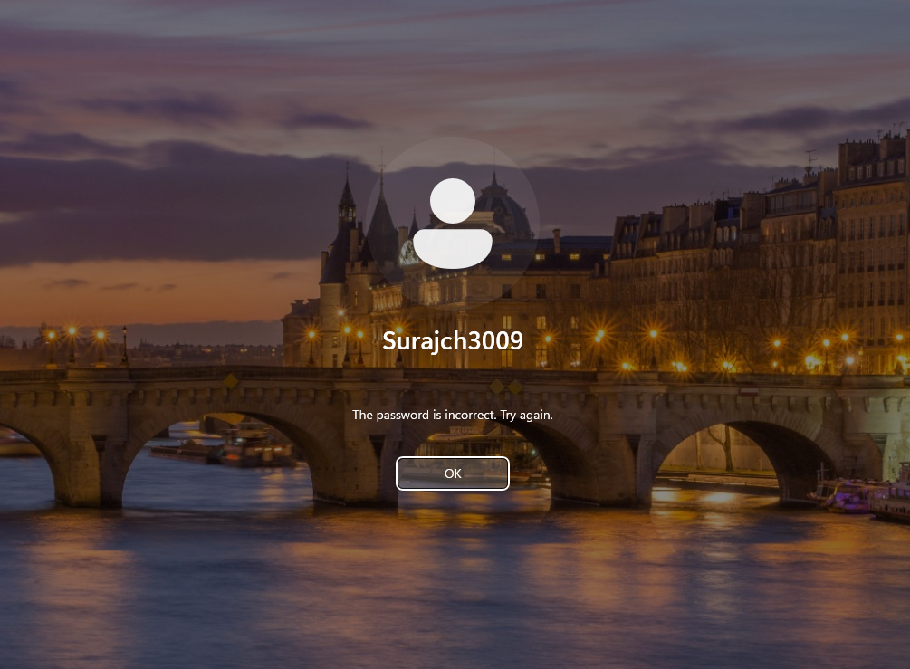
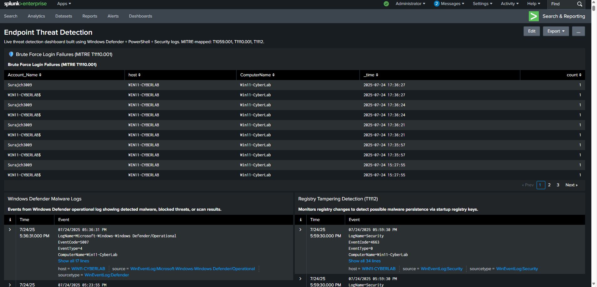
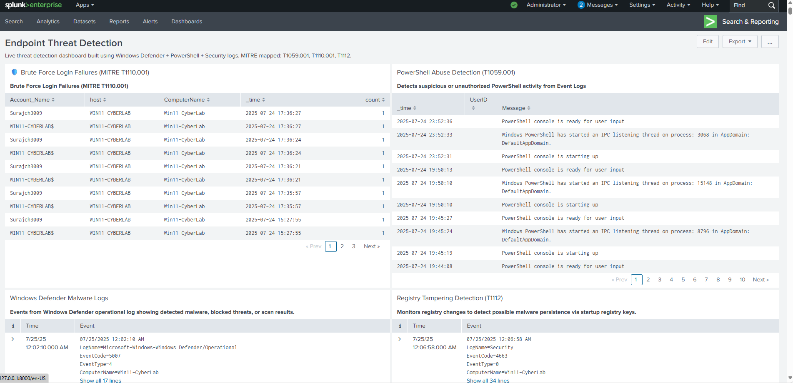

# 🛡️ Endpoint Threat Detection & Response with Splunk + Windows Defender

A hands-on, real-world project that combines **Splunk (Free version)** and **Windows Defender** to simulate and detect attacker behavior using **MITRE ATT&CK techniques**. Built for home lab environments and focused on **EDR (Endpoint Detection & Response)** visibility.

---

## 🧠 Project Overview

This project demonstrates how to detect, visualize, and alert on endpoint-level threats using native Windows logging + Splunk dashboards.

🔍 Core Outcomes:

- Created MITRE-mapped detections
- Simulated real-world threats (PowerShell, Brute-force, Registry changes)
- Built a live Splunk dashboard
- Created custom alerts and documented detection-to-response flow

---

## 🧩 MITRE ATT&CK Mapping

| Technique | Name                             | Description                                 |
|----------|----------------------------------|---------------------------------------------|
| T1059.001 | **PowerShell Execution**         | Detects suspicious PowerShell usage         |
| T1110.001 | **Brute-force Login Attempts**   | Identifies multiple failed login attempts   |
| T1112     | **Registry Modification**        | Flags unauthorized registry changes         |

---

## ⚡ PowerShell Abuse Detection (T1059.001)

This detection focuses on identifying misuse of PowerShell — a favorite for attackers.

### 🔍 Raw Log Sample

We intentionally ran invalid PowerShell commands and system reconnaissance (e.g., `whoami`, `Get-Process`) to generate logs.

### 📊 Dashboard Visualization

✅ Log Source: `WinEventLog:PowerShell`  
✅ Monitored for suspicious command lines, errors, and script abuse.

---

## 🚨 Brute-force Detection (T1110.001)

This detection tracks repeated login failures and visualizes brute-force attack patterns.

### 🔍 Failed Login Screen

We simulated this by entering incorrect passwords multiple times on the lock screen.

### 📊 Brute-force Detection Panel

### ⚙️ Alert Configuration

✅ Custom Splunk alert set to trigger on more than 5 failed attempts in a short time window.

---

## 🛠️ Registry Modification Detection (T1112)

Malware and attackers often modify registry keys silently — this panel detects such changes.

### 🔍 Registry Log Output

✅ EventCode 4657 captured suspicious modifications under HKLM and other paths.

---

## 📊 Final EDR Dashboard

All detection panels were combined into one professional **EDR Monitoring Dashboard**.

✅ Designed for SOC analysts to quickly review endpoint behavior  
✅ Built using built-in Splunk features (no third-party apps)

---

## 🧠 Key Learnings

- Set up a **Splunk Universal Forwarder** to stream live logs from a Windows machine
- Ingested and parsed **PowerShell, Security, and Defender logs**
- Aligned detections with real-world adversary behavior using **MITRE ATT&CK**
- Built **dashboards + alerts** without paid licenses
- Learned how to document and present findings professionally

---

## 💬 Let’s Connect

👉 Want to discuss more EDR or threat detection projects?  
📌 [Connect with me on LinkedIn](https://www.linkedin.com/in/suraj-k-3bb9a0190)

---

> 🔗 Blog created and hosted using **GitHub Pages + Jekyll**  
> ✍️ Maintained by [SurajCyberSecurityProjects](https://github.com/SurajCyberSecurityProjects)

---

---
