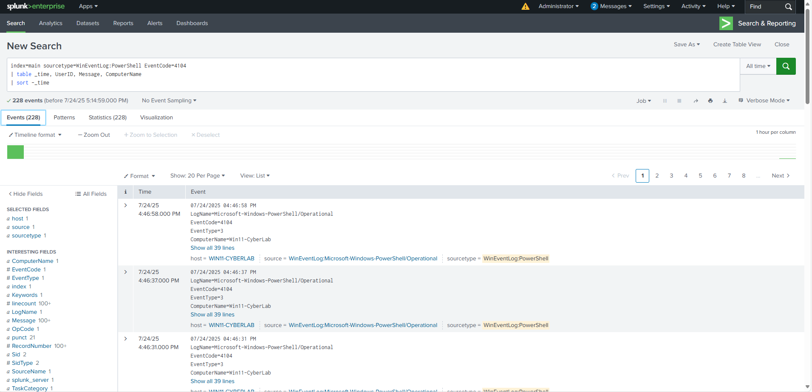

# 🛡️ Endpoint Threat Detection & Response with Splunk + Windows Defender

## 🧠 Project Overview

This hands-on project demonstrates how Splunk (Free) and Windows Defender can be combined to build an **EDR (Endpoint Detection & Response)** setup.  
It simulates real-world attack behaviors and maps them to **MITRE ATT&CK** techniques for learning + professional reporting.

---

## 🧩 MITRE Mapping

We built detections mapped to these ATT&CK tactics:

- **T1059.001 – PowerShell Execution**
- **T1110.001 – Brute-force Login Attempts**
- **T1112 – Registry Modification**

---

## ⚡ PowerShell Abuse Detection (T1059.001)

### 🔍 Raw Logs  

### 📊 Dashboard Panel  

---

## 🚨 Brute-force Detection (T1110.001)

### 🔍 Failed Login Screen  

### 📊 Brute-force Detection Panel  

### ⚙️ Alert Configuration  

---

## 🛠️ Registry Modification Detection (T1112)

### 🔍 Registry Log Output  

---

## 📊 Final EDR Dashboard

Below is the complete dashboard with all 3 detections in one place:  

---

## 🧠 Key Learnings

- Installed and configured Splunk Universal Forwarder on a VM
- Ingested Windows Defender & Event logs into Splunk
- Built detection panels based on real attacker behavior
- Aligned detections with MITRE ATT&CK framework
- Created alert actions for brute-force login attempts

---

## 💬 Let’s Connect

📌 Want to discuss more EDR or threat detection projects?  
👉 [Connect with me on LinkedIn](https://www.linkedin.com/in/suraj-k-3bb9a0190)

---

---
