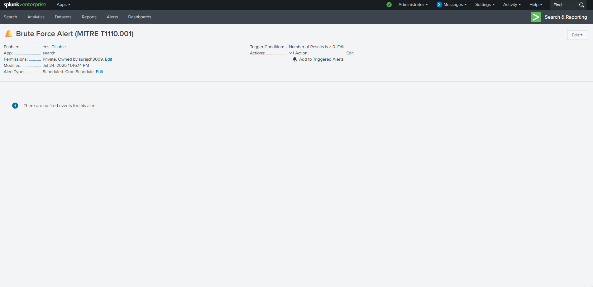
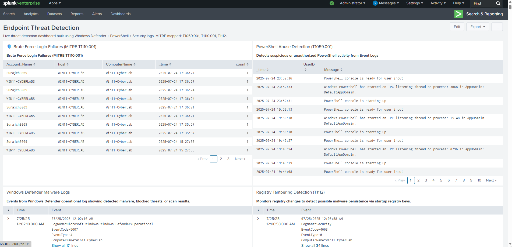

# 🛡️ Endpoint Threat Detection & Response with Splunk + Windows Defender

## 🧠 Project Overview
This project demonstrates how Splunk + Windows Defender can be used to build an **EDR (Endpoint Detection & Response)** monitoring solution on a home lab.

We built:
- A live Splunk dashboard
- MITRE ATT&CK–aligned threat detections (PowerShell, Brute-force, Registry tampering)
- Custom alerts
- Documentation of detection and response lifecycle

---

## 🧩 MITRE Mapping
We mapped detections to the following MITRE techniques:

- **T1059.001 – PowerShell Execution**
- **T1110.001 – Brute-force Logins**
- **T1112 – Registry Modification**

---

## ⚡ PowerShell Abuse Detection (T1059.001)

### 🔍 Raw Logs:

### 📊 Dashboard Panel:

---

## 🚨 Brute-force Detection (T1110.001)

### 🔍 Failed Logins:

### 📊 Dashboard Panel:

### ⚙️ Alert Setup:

---

## 🛠️ Registry Modification Detection (T1112)

### 🔍 Log Output:

---

## 📊 Final EDR Dashboard

Here is the final dashboard showing all detection panels aligned to MITRE.

---

## 🔔 Alerts + Response (Optional)

(You can add your alert-schedule and alert-triggered screenshots here later.)

---

## 🧠 Key Learnings

- Set up Splunk Forwarder to collect logs
- Filtered & parsed event codes from Security & PowerShell logs
- Created real-world EDR dashboard
- Mapped to MITRE techniques used in SOCs

---

> 💬 Connect with me on [LinkedIn](https://www.linkedin.com/) to explore more such defensive projects!

